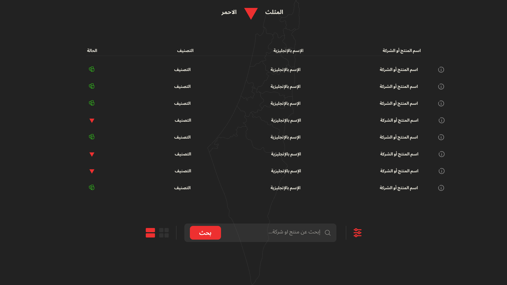
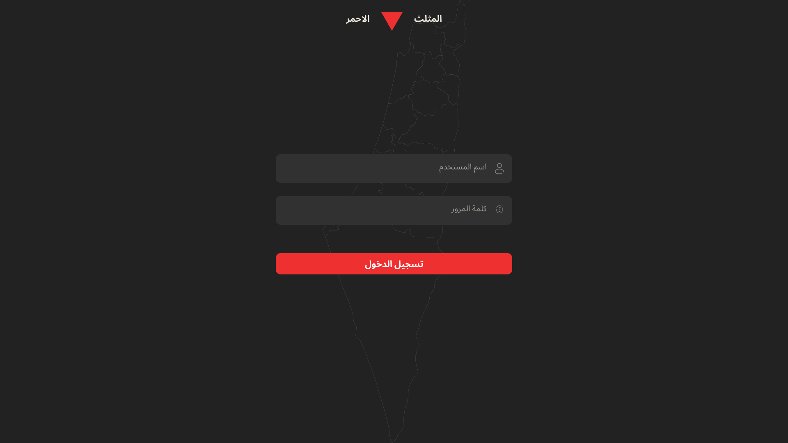
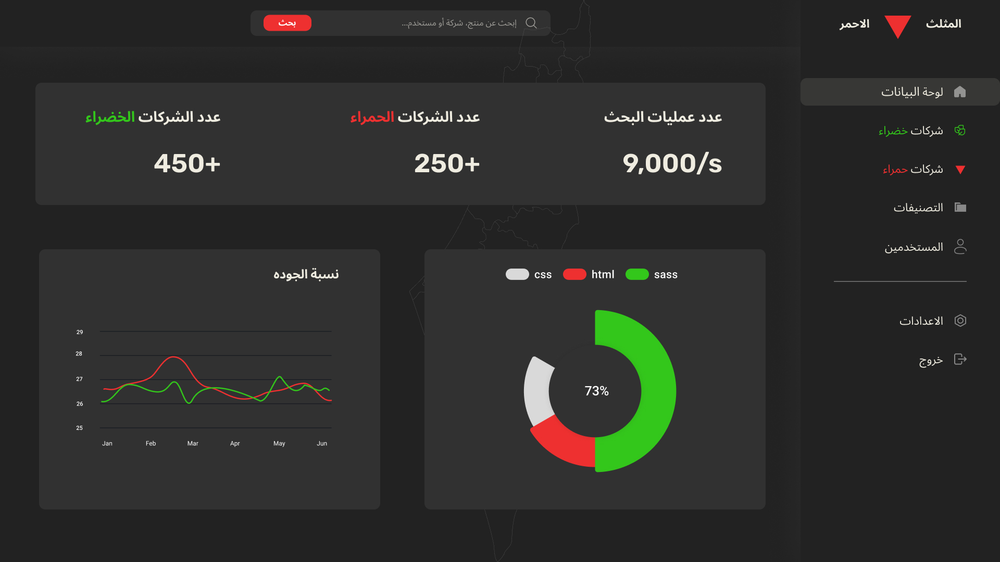

# Red Triangle
The Red Triangle is a website for displaying products that support the Zionist entity, so that consumers can avoid buying them and display local or global alternatives that support and support Palestine.

---
## Screanshots from project

| Main | Login | Dashboard |
| ---- | ----- | --------- |
|  |  |  |

---
## Directory Structure
```tree
.
├── configs     // All configration files like database configs
├── controllers // Contoller logic and handel requests and routes 
├── models      // Database models
├── pages       // Individual page components
├── static      // All web static files
│   ├── img     // images (jpg, png, svg, icon)
│   └── style   // Css styles
└── templates   // HTML templates
```
## Tools:
* HTML
* CSS
* PHP
* MySQL
---
